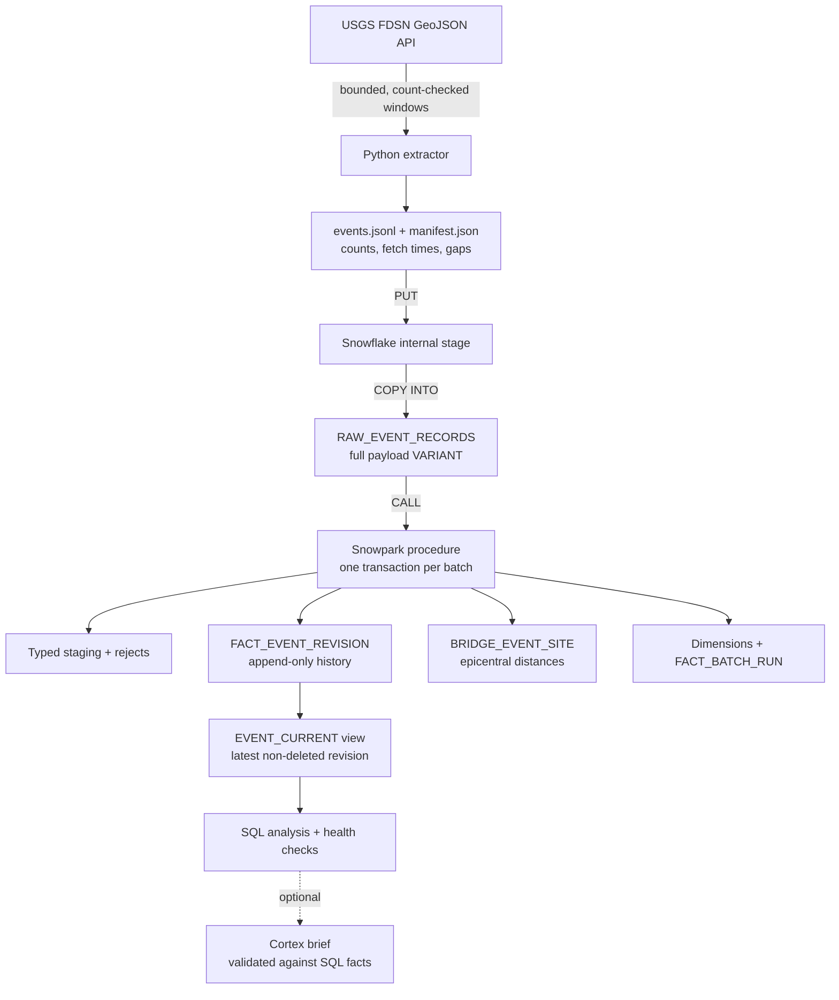
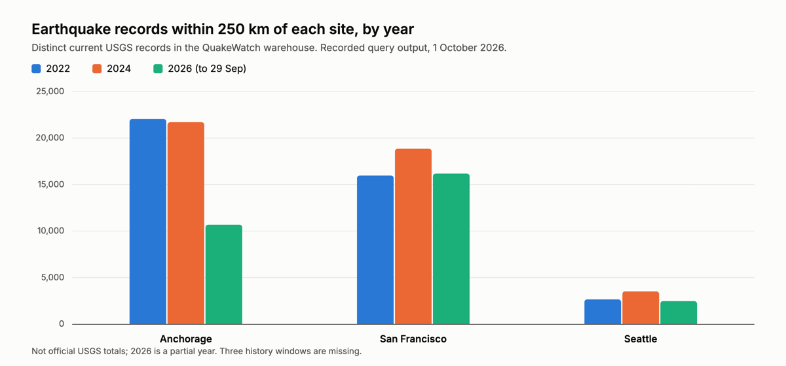

# QuakeWatch

[](https://github.com/kaarthikmohaan/quakewatch/actions/workflows/ci.yml)
[](LICENSE)

**An auditable Snowflake batch warehouse that loads five years of USGS earthquake records, keeps every source revision, and can replay any batch without refetching it.**

`Python 3.12` · `httpx` · `uv` · **Snowflake:** internal stage, `COPY INTO`, Snowpark Python procedures, Time Travel, zero-copy clones, Cortex · `SQL` · `GitHub Actions`

> QuakeWatch is retrospective data analysis. It is not an earthquake warning, risk score, shaking estimate, or damage assessment. Distance and magnitude alone do not estimate impact.

## What problem it solves

A facilities-planning or preparedness analyst who wants to compare earthquake
history around candidate sites usually scans USGS maps or downloads records by
hand. That looks simple but quietly goes wrong:

- **Records change after the fact.** USGS revises magnitudes, locations, and
  status for days or years, and deletes some events. A one-off download is a
  snapshot that is silently out of date, with no record of what changed.
- **Large requests are truncated or time out.** The API caps each response at
  20,000 events and offers no consistent snapshot of the catalog, so a big
  download can be incomplete without saying so.
- **Results can't be reproduced or audited.** Re-running "the same" download
  later gives different numbers, and nobody can tell which records were
  included.

QuakeWatch turns that into a repeatable, auditable warehouse. Every batch
records exactly what was requested and received, every revision and deletion is
kept, gaps are reported instead of hidden, and the same SQL gives the same
answer. It answers questions like:

- How do event counts and magnitudes compare across sites and years?
- Which records were revised or deleted, and when did the warehouse see it?
- How long does a record take to go from fetch to queryable?
- Which requested time windows are missing?

The analyst use case is a hypothesis: no target user has tested it yet (see
[known limitations](#known-limitations)).

## Key results

Verified on 2 October 2026 by re-running the checks from a clean clone:
read-only queries against the live warehouse plus the full local suite.
Query IDs, method, and earlier dated runs are in the
[evidence log](docs/evidence/results-log.md#verification-audit-2026-10-02).

| Measure | Result |
|---|---|
| History windows loaded and reconciled | **177 of 180**; windows 12, 42, and 73 are recorded USGS source gaps |
| Rows reconciled in the warehouse | **216,391** across **179** batch receipts: RAW = staged = processed + rejected (216,361 history rows plus two 15-row Seattle samples) |
| Rows rejected with a recorded reason | **485**, all USGS placeholder ("stub") records whose events exist as full records under another ID ([analysis](docs/results.md#reject-analysis)) |
| Duplicate revision or site-bridge keys | **0** |
| Fetch-to-curated latency, 179 attempts | p95 **35.9 h**, missing the 24 h target set before measuring; the one batch processed as it landed took **293 s** |
| Live SQL compile check | **35 of 35** procedure and query statements compile against the live schema |
| Tests, run in CI with lint, format, and type checks | **340** passing, covering **86%** of `src/` |
| Clean clone to first successful run | **3 min 15 s**, following this README |

Also demonstrated in earlier recorded runs, not repeated on 2 October: a
failed transform retried from RAW without refetching, a clone and Time Travel
recovery, and a Cortex summary evaluation with SQL fact checks. Their results
are in the [evidence log](docs/evidence/results-log.md).

## Architecture



Each batch keeps its full source records and counts, so a failed transformation
can be retried from RAW without calling USGS again. A separate, optional drill
clones a fixture table, applies a bad change, and recovers it with Time Travel.
GitHub Actions runs the fixture tests without any Snowflake credentials.

## Sample analysis

Distinct current earthquake records within 250 km of each public example site,
by year (simplified from the [reviewed aggregate query](sql/analysis/site_year_aggregates.sql)):

```sql
SELECT b.SITE_KEY,
       YEAR(e.ORIGIN_TIME) AS EVENT_YEAR,
       COUNT(DISTINCT e.CANONICAL_EVENT_ID) AS EVENTS_WITHIN_250_KM
FROM CURATED.EVENT_CURRENT e
JOIN CURATED.BRIDGE_EVENT_SITE b
  ON  e.CANONICAL_EVENT_ID = b.CANONICAL_EVENT_ID
  AND e.SOURCE_UPDATED_AT  = b.SOURCE_UPDATED_AT
  AND e.PAYLOAD_HASH       = b.PAYLOAD_HASH
WHERE b.WITHIN_RADIUS
GROUP BY 1, 2;
```

Output of the 2 October 2026 verification run (chart drawn from these values):

<picture>
  <source media="(prefers-color-scheme: dark)" srcset="docs/images/site-year-counts-dark.png">
  
</picture>


| Site | 2022 | 2024 | 2026 (to 29 Sep) |
|---|---:|---:|---:|
| Anchorage | 22,056 | 21,711 | 10,685 |
| San Francisco | 15,975 | 18,859 | 16,183 |
| Seattle | 2,651 | 3,514 | 2,469 |

These are currently modeled records, not official USGS totals. Three source
gaps and the incomplete update sweep mean coverage is not guaranteed complete.

### Cortex summary

Snowflake Cortex can turn one SQL result row into a plain-English sentence. The
model only sees the facts in that row, and every sentence is checked against
them before use; if any fact is wrong, the SQL row is shown instead.

**SQL facts (Seattle, 2024):**

| Window (UTC) | Radius | Events | Nearest event | Distance from site | Magnitude | Status | Record age |
|---|---:|---:|---|---:|---:|---|---:|
| 2024-01-01 to 2025-01-01 | 250 km | 3,514 | `uw61978781` | 5.1 km | 1.87 | reviewed | 24,031.1 h |

**Cortex output** (`claude-haiku-4-5`, 1 October 2026, 202 prompt and 100
completion tokens; passed automatic validation and human fact review):

> In the modeled Seattle sample for 2024-01-01T00:00:00Z to
> 2025-01-01T00:00:00Z, 3514 events were within 250 km; the nearest event
> uw61978781 was 5.1 km from Seattle, magnitude 1.87, source status reviewed,
> and its source record was 24031.1 hours old at the SQL check time.

**Why the check matters:** an earlier brief for the Seattle-day sample said the
nearest event was *"42.1 km away from uw714111042"*, measuring the distance from
the event's own ID instead of from the site. Validation rejected it and the SQL
row was used. Across 13 calls, 9 of 9 evaluated briefs passed and 4 others were
rejected this way ([evaluation](docs/evidence/phase4-cortex-evaluation.md)).

## Design decisions

- **Batch, not streaming.** The USGS FDSN API answers bounded queries and offers
  no consistent catalog snapshot. Bounded batches with saved manifests make
  every window auditable and replayable. Streaming tools would add cost without
  adding correctness.
- **Revisions are history, not overwrites.** A revision is identified by
  `(canonical_event_id, source_updated_at, payload_hash)`. Repeated or
  overlapping batches converge to the same facts, and the current view picks the
  latest revision with fixed tie-breakers.
- **Deletions are tombstones.** A deleted event stays in history as a deleted
  revision. An older backfill that still contains the event cannot bring it
  back.
- **The watermark moves only after full reconciliation.** The update sweep
  advances its `updatedafter` watermark only when every window's before, fetched,
  and after counts agree. A partial sweep stays retryable instead of silently
  skipping changes.
- **One writer per table, one transaction per batch.** The loader owns RAW; the
  Snowpark procedure owns the models. Model writes and the success audit commit
  together. A failure rolls back and is logged separately, so a retry never
  erases the earlier failure.
- **Windows sized below the source cap.** The USGS count endpoint sizes each
  request below the 20,000-row limit, and windows split when needed. Any window
  that cannot reconcile is recorded as a gap, never silently dropped.

## Quickstart

From the repository root, use Python 3.12 and [uv](https://docs.astral.sh/uv/):

```sh
uv sync --locked --no-editable
.venv/bin/quakewatch-extract \
  --site seattle \
  --start 2026-09-28T00:00:00Z \
  --end 2026-09-29T00:00:00Z
```

This is a dated example. Change the site and UTC time range for a new batch;
supported sites are `seattle`, `san-francisco`, and `anchorage`. Each run prints
a new attempt ID and saves `events.jsonl` plus `manifest.json` under
`data/raw/<attempt-id>/`. The `data/` directory is excluded from Git.

To check a saved batch locally, replace `PASTE_ATTEMPT_ID_HERE` with the ID
printed by the extractor:

```sh
attempt_id=PASTE_ATTEMPT_ID_HERE
PYTHONPATH=src .venv/bin/python -m quakewatch.raw_load \
  "data/raw/$attempt_id/manifest.json"
```

That check prints the expected row count and Snowflake stage path. It does not
upload or process data.

To run the warehouse path you need your own Snowflake account:

1. Copy the profiles in [`snowflake-config.example.toml`](snowflake-config.example.toml)
   into `~/.snowflake/config.toml` and fill in your account and key details.
2. Run `sql/setup/01_bootstrap_admin.sql` once with an admin role, then
   `make bootstrap EXECUTE=1` to create the tables and procedure.
3. Run the pipeline with `make capture-history`, `make load-history`,
   `make process`, and `make quality`, each previewing first and running with
   `EXECUTE=1`. `make help` lists every target; [`scripts/README.md`](scripts/README.md)
   explains the order.

Live runs use warehouse credits. Command output goes to stdout; operational
logs go to stderr with UTC timestamps, and `QUAKEWATCH_LOG_LEVEL=DEBUG` shows
more detail. There is no `.env` file: credentials stay in your
`~/.snowflake/config.toml` ([ADR 0009](docs/adr/0009-local-secret-config.md)).
See the [operations reference](docs/operations-reference.md) for every command.

`make check` runs everything CI runs: ruff lint and format check, mypy, and the
tests under coverage (minimum 80%). `make integration EXECUTE=1` is the live,
read-only check: it compiles every SQL statement the procedure and checks use
against Snowflake with `EXPLAIN`, then runs the post-run and uniqueness checks
([ADR 0010](docs/adr/0010-live-integration-check.md)). On GitHub the same check
runs from the manually triggered **Snowflake integration** workflow once its
secrets are set (see [CONTRIBUTING](CONTRIBUTING.md#live-integration-check)).

## Known limitations

- **Three history windows (12, 42, and 73) are missing.** USGS requests for them
  timed out even after splitting, so they are reported as gaps rather than
  filled in.
- **The catalog-wide update sweep is incomplete.** One bounded source request
  times out, so the update watermark has not advanced. Old-event revisions and
  deletions are proven on fixtures, not yet on a full live sweep.
- **The first backfill missed its latency target.** The p95 fetch-to-curated
  time was 35.9 hours against a 24-hour target, mainly because curation was run
  manually in bulk after loading.
- **No user validation yet.** The target analyst interview has not taken place,
  so usefulness for facilities planning is unconfirmed.
- **Recovery drills used fixture tables**, not the main warehouse, and Time
  Travel retention is one day.
- **Runs are manual.** There is no scheduler, and this is not a production
  service with uptime guarantees.

## Lessons learned

- **Test from a clean checkout.** The first CI run failed because tests relied
  on generated fixture files that existed only on my machine. CI now builds
  them before testing ([log](docs/evidence/results-log.md#first-github-actions-fixture-run)).
- **A reject label should name the cause.** All 485 rejects were labelled
  `invalid_origin_time` until I traced them to USGS placeholder records
  ([analysis](docs/results.md#reject-analysis)). I should have done that
  analysis when the count first appeared.
- **Manual bulk steps hide latency.** Curating the whole backfill in one manual
  run is why p95 fetch-to-curated reached 35.9 hours against a 24-hour target.
  Processing each batch as it lands, on a schedule, is the fix.
- **Guards must match the code they check.** A recovery-drill guard expected
  zero `MERGE` changes, but the writer counts updates too, so a correct retry
  was flagged as a failure ([log](docs/evidence/results-log.md#isolated-failed-transform-and-retry-drill)).
- **Validate model output against the facts.** Cortex briefs misstated a fact
  in 4 of 13 calls, such as the search radius or the point a distance was
  measured from. Strict checks with a SQL fallback caught every one.
- **Splitting a window does not fix a slow source.** Three history windows and
  the update sweep still time out on single small requests, so a different
  capture strategy is needed.

**How this was built:** I used AI coding assistants to help draft code, tests,
and documentation. The design decisions, every live Snowflake and USGS run, and
the checking of the results recorded here were mine. The
[decision records](docs/adr/README.md) explain why the project works the way it
does.

## What I'd do next

Tracked as issues in the [v0.2.0 milestone](https://github.com/kaarthikmohaan/quakewatch/milestone/1):

1. Finish the catalog-wide update sweep and commit the first watermark
   ([#4](https://github.com/kaarthikmohaan/quakewatch/issues/4)).
2. Resolve or formally close the three history gaps
   ([#5](https://github.com/kaarthikmohaan/quakewatch/issues/5)).
3. Run the pipeline on a schedule and measure steady-state latency
   ([#6](https://github.com/kaarthikmohaan/quakewatch/issues/6)).
4. Run the procedure end to end in a disposable copy of the warehouse
   ([#7](https://github.com/kaarthikmohaan/quakewatch/issues/7)).
5. Redeploy the procedure from the formatted code
   ([#8](https://github.com/kaarthikmohaan/quakewatch/issues/8)).
6. Run the target-analyst session and compare task time with their manual
   baseline ([#9](https://github.com/kaarthikmohaan/quakewatch/issues/9)).

## Repository layout

```text
src/quakewatch/   Extractor, loaders, and Snowpark procedure code
sql/              Snowflake SQL by purpose: setup/ (numbered), load/, checks/, analysis/, demos/
scripts/          Pipeline steps, checks, test-fixture builders, and evidence drills (scripts/README.md)
tests/            Secret-free unit and fixture tests run in CI
Makefile          One command per step; `make help` lists them
docs/             Design, data dictionary, results summary, and operations reference
docs/adr/         Architecture decision records
docs/evidence/    Dated records: results log, live demo, environment check, Phase 4 close-out, Cortex evaluation
docs/plans/       Working plans for individual drills
```

## Docs

**Start here** (about 15 minutes): the [results summary](docs/results.md), the
[decision records](docs/adr/README.md), and the
[data dictionary](docs/data-dictionary.md) with its ERD. Everything else is
reference material.

| To… | Read |
|---|---|
| Run it | [Operations reference](docs/operations-reference.md), [scripts guide](scripts/README.md), [SQL setup order](sql/README.md) |
| See it run | [Live demo walkthrough](docs/evidence/live-demo-2026-10-02.md), [two-minute demo](docs/demo.md) |
| Check the evidence | [Evidence log](docs/evidence/results-log.md), [Phase 4 close-out](docs/evidence/phase4-closeout.md), [Cortex evaluation](docs/evidence/phase4-cortex-evaluation.md), [environment check](docs/evidence/phase0-environment-check.md) |
| See what changed | [Changelog](CHANGELOG.md) |
| See the original plan | [Design](docs/design.md), [target-analyst interview guide](docs/target-user-interview.md) |
| Contribute | [Contributing](CONTRIBUTING.md), [code of conduct](CODE_OF_CONDUCT.md), [security policy](SECURITY.md), [accessibility](ACCESSIBILITY.md) |

## Scope, source, and license

QuakeWatch is a single-developer MVP of a complete batch path: extraction,
loading, modeling, quality checks, and recovery, run manually against a
personal Snowflake account. It is deliberately not a production service.

Earthquake records come from the [U.S. Geological Survey](https://earthquake.usgs.gov/).
Credit USGS and link to official records when presenting data. Use public
example coordinates only. QuakeWatch must not be used for safety decisions.

Code is released under the [MIT License](LICENSE); USGS data remains subject to
USGS terms.
