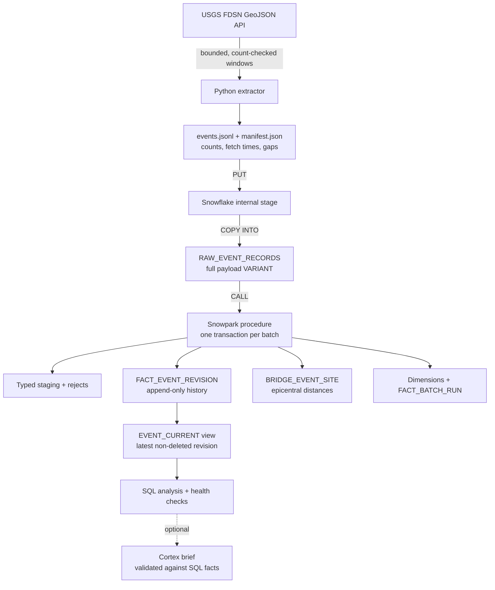

# QuakeWatch

[](https://github.com/kaarthikmohaan/quakewatch/actions/workflows/ci.yml)
[](LICENSE)

**An auditable Snowflake batch warehouse that loads five years of USGS earthquake records, keeps every source revision, and can replay any batch without refetching it.**

`Python 3.12` · `httpx` · `uv` · **Snowflake:** internal stage, `COPY INTO`, Snowpark Python procedures, Time Travel, zero-copy clones, Cortex · `SQL` · `GitHub Actions`

> QuakeWatch is retrospective data analysis. It is not an earthquake warning, risk score, shaking estimate, or damage assessment. Distance and magnitude alone do not estimate impact.

## Key results

Measured on live Snowflake runs between 29 September and 1 October 2026. Full evidence, query IDs, and caveats are in [observed results](docs/results.md).

| Measure | Result |
|---|---|
| History windows loaded and reconciled | **177 of 180** (3 recorded as USGS source gaps) |
| Source rows loaded into RAW | **216,361** across Seattle, San Francisco, and Anchorage |
| Rows rejected with a recorded reason | **485**, all `invalid_origin_time`, kept for review |
| Duplicate revision or site-bridge keys | **0** |
| Batch receipts reconciled (RAW = staged = processed + rejected) | **All 178** |
| Failed-transform retry from RAW, with no refetch | **Passed**, with identical counts after rollback and retry |
| Clone and Time Travel recovery drill | **Passed** on an isolated fixture table |
| Secret-free unit and fixture tests in CI | **303** |
| Cortex summaries passing human fact review | **9 of 9** evaluated (2 earlier briefs rejected); **0.0039** AI credits for 11 calls |
| First-backfill fetch-to-curated p95 | **35.9 h, missing the 24 h target** set before measuring |

## Architecture



Each batch keeps its full source records and counts, so a failed transformation
can be retried from RAW without calling USGS again. A separate, optional drill
clones a fixture table, applies a bad change, and recovers it with Time Travel.
GitHub Actions runs the fixture tests without any Snowflake credentials.

## Sample analysis

Distinct current earthquake records within 250 km of each public example site,
by year (simplified from the [reviewed aggregate query](sql/phase4_cortex_aggregates.sql)):

```sql
SELECT b.SITE_KEY,
       YEAR(e.ORIGIN_TIME) AS EVENT_YEAR,
       COUNT(DISTINCT e.CANONICAL_EVENT_ID) AS EVENTS_WITHIN_250_KM
FROM CURATED.EVENT_CURRENT e
JOIN CURATED.BRIDGE_EVENT_SITE b
  ON  e.CANONICAL_EVENT_ID = b.CANONICAL_EVENT_ID
  AND e.SOURCE_UPDATED_AT  = b.SOURCE_UPDATED_AT
  AND e.PAYLOAD_HASH       = b.PAYLOAD_HASH
WHERE b.WITHIN_RADIUS
GROUP BY 1, 2;
```

Recorded output on 1 October 2026:

| Site | 2022 | 2024 | 2026 (to 29 Sep) |
|---|---:|---:|---:|
| Anchorage | 22,056 | 21,711 | 10,685 |
| San Francisco | 15,975 | 18,859 | 16,183 |
| Seattle | 2,651 | 3,514 | 2,469 |

These are currently modeled records, not official USGS totals. Three source
gaps and the incomplete update sweep mean coverage is not guaranteed complete.

## Design decisions

- **Batch, not streaming.** The USGS FDSN API answers bounded queries and offers
  no consistent catalog snapshot. Bounded batches with saved manifests make
  every window auditable and replayable. Streaming tools would add cost without
  adding correctness.
- **Revisions are history, not overwrites.** A revision is identified by
  `(canonical_event_id, source_updated_at, payload_hash)`. Repeated or
  overlapping batches converge to the same facts, and the current view picks the
  latest revision with fixed tie-breakers.
- **Deletions are tombstones.** A deleted event stays in history as a deleted
  revision. An older backfill that still contains the event cannot bring it
  back.
- **The watermark moves only after full reconciliation.** The update sweep
  advances its `updatedafter` watermark only when every window's before, fetched,
  and after counts agree. A partial sweep stays retryable instead of silently
  skipping changes.
- **One writer per table, one transaction per batch.** The loader owns RAW; the
  Snowpark procedure owns the models. Model writes and the success audit commit
  together. A failure rolls back and is logged separately, so a retry never
  erases the earlier failure.
- **Windows sized below the source cap.** The USGS count endpoint sizes each
  request below the 20,000-row limit, and windows split when needed. Any window
  that cannot reconcile is recorded as a gap, never silently dropped.

## Quickstart

From the repository root, use Python 3.12 and [uv](https://docs.astral.sh/uv/):

```sh
uv sync --locked --no-editable
uv run quakewatch-extract \
  --site seattle \
  --start 2026-09-28T00:00:00Z \
  --end 2026-09-29T00:00:00Z
```

This is a dated example. Change the site and UTC time range for a new batch;
supported sites are `seattle`, `san-francisco`, and `anchorage`. Each run prints
a new attempt ID and saves `events.jsonl` plus `manifest.json` under
`data/raw/<attempt-id>/`. The `data/` directory is excluded from Git.

To check a saved batch locally, replace `PASTE_ATTEMPT_ID_HERE` with the ID
printed by the extractor:

```sh
attempt_id=PASTE_ATTEMPT_ID_HERE
PYTHONPATH=src .venv/bin/python -m quakewatch.raw_load \
  "data/raw/$attempt_id/manifest.json"
```

That check prints the expected row count and Snowflake stage path. It does not
upload or process data. A live Snowflake load needs the configured project
connection and can use warehouse credits; see the [runbook](docs/runbook.md).

## Known limitations

- **Three history windows (12, 42, and 73) are missing.** USGS requests for them
  timed out even after splitting, so they are reported as gaps rather than
  filled in.
- **The catalog-wide update sweep is incomplete.** One bounded source request
  times out, so the update watermark has not advanced. Old-event revisions and
  deletions are proven on fixtures, not yet on a full live sweep.
- **The first backfill missed its latency target.** The p95 fetch-to-curated
  time was 35.9 hours against a 24-hour target, mainly because curation was run
  manually in bulk after loading.
- **No user validation yet.** The target analyst interview has not taken place,
  so usefulness for facilities planning is unconfirmed.
- **Recovery drills used fixture tables**, not the main warehouse, and Time
  Travel retention is one day.
- **Runs are manual.** There is no scheduler, and this is not a production
  service with uptime guarantees.

## What I'd do next

1. Finish the update sweep by splitting the timed-out request into smaller
   update-time windows, then advance the watermark.
2. Retry or formally close the three history gaps.
3. Schedule regular batches and measure steady-state latency, not just the
   first backfill.
4. Run the target-analyst session and compare task time with their manual
   baseline.
5. Add a gated Snowflake integration job to CI alongside the fixture tests.

## Docs

- [Design and project plan](docs/design.md)
- [Data dictionary](docs/data-dictionary.md): tables, grains, and keys
- [Runbook](docs/runbook.md)
- [Observed results](docs/results.md)
- [Phase 4 close-out and remaining work](docs/phase4-closeout.md)
- [Cortex evaluation](docs/phase4-cortex-evaluation.md)
- [Two-minute evidence-based demo](docs/demo.md)
- [Phase 0 environment check](docs/environment.md)
- [Target-analyst interview guide](docs/target-user-interview.md)
- [Contributing](CONTRIBUTING.md) · [Code of conduct](CODE_OF_CONDUCT.md) · [Security policy](SECURITY.md) · [Accessibility](ACCESSIBILITY.md)

## Scope, source, and license

QuakeWatch is a single-developer MVP of a complete batch path: extraction,
loading, modeling, quality checks, and recovery, run manually against a
personal Snowflake account. It is deliberately not a production service.

Earthquake records come from the [U.S. Geological Survey](https://earthquake.usgs.gov/).
Credit USGS and link to official records when presenting data. Use public
example coordinates only. QuakeWatch must not be used for safety decisions.

Code is released under the [MIT License](LICENSE); USGS data remains subject to
USGS terms.
