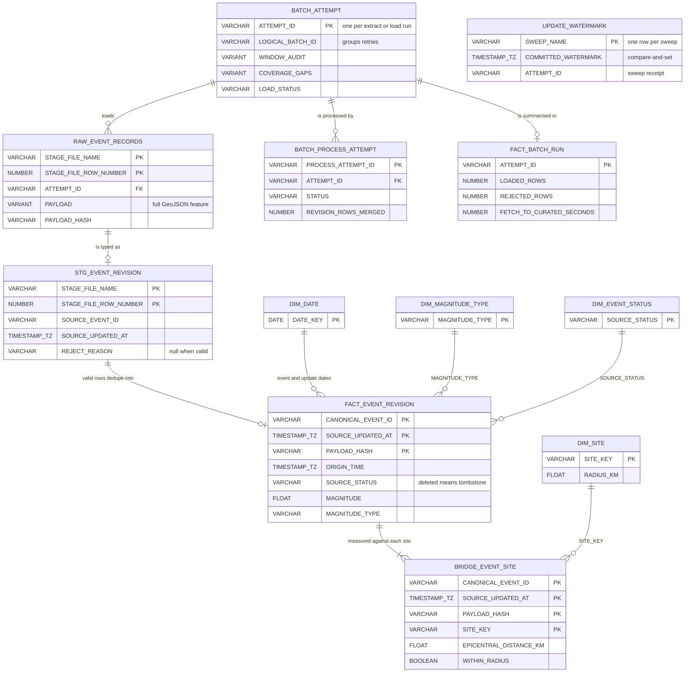

# Data dictionary

## Current local extract

The extractor writes one JSON object per line to `events.jsonl`. Each line contains the complete USGS GeoJSON feature under `source_feature` and capture metadata under `metadata`.

| Field | Meaning |
|---|---|
| `source_feature` | Full source GeoJSON feature, preserved without narrowing its properties |
| `metadata.logical_batch_id` | Stable identifier for the requested site and time range |
| `metadata.attempt_id` | Unique identifier for this execution, including retries |
| `metadata.window_id` | Query window that returned this observation; recursive splits get child IDs |
| `metadata.fetched_at` | UTC time the local batch captured the feature |
| `metadata.payload_hash` | SHA-256 of canonicalized source-feature JSON |
| `metadata.parser_version` | Version of the local raw-record envelope; currently `1` |

`manifest.json` records the requested site and time range, query parameters, per-window counts before and after retrieval, returned and written row counts, and final status. Local raw output is ignored by Git. At the 2 October 2026 verification, RAW held 179 batches: 177 complete planned history windows and two 15-row Seattle samples. Three planned history windows remain source gaps. See [observed results](results.md) for verified counts.

## Warehouse grains

See [design.md](design.md) for the full model. RAW has one source feature per query window and attempt. The revision fact has one distinct canonical event revision. The current-event view selects the latest non-stale revision and hides a latest tombstone. The 2 October verification found zero duplicate revision or bridge key groups across all 179 processed batches, and all 485 rejects under one reason (`source_stub_record`); see [observed results](results.md).

### Entity relationships

Key columns only; the full column lists are in the linked DDL below. `PK` marks
each table's grain, which is enforced by SQL uniqueness checks rather than by
Snowflake constraints. Dimensions join on natural values, and `DIM_DATE` is
role-played by the dates of `ORIGIN_TIME` and `SOURCE_UPDATED_AT`.
`UPDATE_WATERMARK` stands alone: it records how far the update sweep has
committed and is read and advanced only by the update loader.
`EVENT_CURRENT` is a view over `FACT_EVENT_REVISION` that keeps each event's
latest revision and hides it when that revision is a deleted tombstone.

## Phase 1 raw tables

The [raw-table SQL](../sql/setup/02_raw_tables.sql) defines two tables in `QUAKEWATCH.RAW`:

| Table | Grain and important fields |
|---|---|
| `BATCH_ATTEMPT` | One append-only receipt per extract/load attempt, including failures. `LOGICAL_BATCH_ID` groups retries; `ATTEMPT_ID` identifies this execution. It keeps requested bounds, query parameters, window audit, coverage gaps, source/written/loaded counts, statuses, copy results, and the complete manifest. An update sweep can have no `SITE_KEY`. |
| `RAW_EVENT_RECORDS` | One returned GeoJSON feature per attempt and query window. `PAYLOAD VARIANT` retains the complete `source_feature`. Attempt/window IDs, fetch time, payload hash, parser version, staged file name and file row number identify where it came from. |
| `UPDATE_WATERMARK` | One row per named update sweep. Holds the committed `updatedafter` watermark, the previous watermark, the sweep's `ATTEMPT_ID`, and its catalog bounds. The update loader advances it by compare-and-set only after the sweep's RAW receipt and per-window counts reconcile. See the [DDL](../sql/setup/03_update_watermark.sql). |

The pair `(STAGE_FILE_NAME, STAGE_FILE_ROW_NUMBER)` identifies a row in a staged file. The loader uses an attempt-specific stage path so this pair stays stable. It is not a global event ID and it does not deduplicate overlapping windows or retry attempts. Phase 1 reconciles these rows with the attempt manifest; the Phase 2 procedure deduplicates logical event revisions.

## Phase 2 typed staging contract

`STG_EVENT_REVISION` has one row per RAW source observation, before revision deduplication. It reads `RAW_EVENT_RECORDS.PAYLOAD` without modifying that `VARIANT`. The source attempt ID, window ID, fetch time, payload hash, and staged file-row key remain attached so a rejected projection can be traced back to its original feature.

| Typed field | GeoJSON source | Rule |
|---|---|---|
| `source_event_id` | `id` | Required non-empty string; preserve exactly as supplied |
| `origin_time` | `properties.time` | Required epoch milliseconds, converted to UTC |
| `source_updated_at` | `properties.updated` | Required epoch milliseconds, converted to UTC |
| `source_status` | `properties.status` | Required non-empty string; `deleted` remains a tombstone candidate |
| `associated_ids` | `properties.ids` | Preserve the source list for later alias resolution; absence is allowed |
| `magnitude`, `magnitude_type`, `place` | `properties.mag`, `magType`, `place` | Nullable typed attributes; never infer a missing magnitude |
| `longitude`, `latitude`, `depth_km` | `geometry.coordinates` | Validate a Point's longitude/latitude for active records; allow nullable geometry on a deleted tombstone |

An invalid required ID, clock, status, or active-record location goes to rejects with a reason and its RAW source key. Parser version 2 adds two reasons: `source_stub_record` for USGS placeholder features with no time, magnitude, or status, and `placeholder_location` for an active record at the `[0, 0]` placeholder; see the [reject analysis](results.md#reject-analysis). Optional fields and newly added source fields remain in the preserved `VARIANT`; they do not silently change this typed contract. This staging step does not choose a canonical ID or a current revision. Those decisions belong to the revision fact and current view after alias and tombstone rules are applied.

The [staging DDL](../sql/setup/04_staging_table.sql) defines this grain in `QUAKEWATCH.CURATED.STG_EVENT_REVISION`. It carries the staged file-row key, attempt/window IDs, fetch time, payload hash, both RAW and staging parser versions, the typed fields above, `REJECT_REASON`, and projection time. This table and the procedure were deployed for the bounded pilot; the isolated fixture copy was also exercised. `CREATE TABLE IF NOT EXISTS` does not verify an existing table's shape, so inspect it before reapplying DDL.

The local [projection function](../src/quakewatch/staging.py) implements the first row-level parser contract used by the Snowpark procedure. It converts integer epoch milliseconds to UTC, checks required ID/time/status and active Point coordinates, and returns one stable `reject_reason` for an invalid row. A deleted feature may have no geometry. Nullable magnitude, magnitude type, place, and depth stay nullable; malformed non-null values are rejected rather than silently cast. The USGS comma-delimited `properties.ids` becomes a list for later alias work. This function does not modify RAW, load Snowflake, resolve aliases, or choose a current revision.

Before the revision fact `MERGE`, the local [candidate deduplication helper](../src/quakewatch/revisions.py) uses `(canonical_event_id, source_updated_at, payload_hash)` as the logical revision key. It keeps the observation with the latest fetch time, breaking ties by staged file-row key, independent of input order. Different payload hashes at one update time remain distinct. Conflicting content under one staged file-row key fails instead of hiding a duplicate merge source.

The local [alias helper](../src/quakewatch/aliases.py) connects each preferred `source_event_id` to its associated IDs, including transitive links, and chooses the lexicographically first exact ID in each connected component. It works independently of row order and gives a preferred-ID change one canonical identity. The [durable alias reader](../src/quakewatch/snowpark_alias_read.py) builds that map from all accepted staging observations after the current batch's staging MERGE, and checks that every accepted current ID is present. A newly discovered alias can change a prior canonical key. The local [rekey writer](../src/quakewatch/snowpark_alias_rekey.py) chooses the latest-fetched row when old aliases collide on the same revision key, checks that its three public-site bridge rows exist, removes the other fact/bridge copies, then updates surviving canonical keys inside the model transaction. Unexpected duplicate or orphaned keys stop before DML, and each deletion/update must affect its preflight row count. RAW and staging source observations stay preserved. The procedure's conditional collision handling was reviewed and approved before the history attempts were processed. The procedure results do not separately measure how many rows were deleted or rekeyed; do not infer zero from a successful call.

The local [current-revision selector](../src/quakewatch/revisions.py) ranks each canonical event's revisions by source update time, then fetch time, then payload hash, with the staged file-row key as a final stable tie-breaker. It retains a latest `deleted` tombstone in history but hides that event from the visible current set. A later stale replay cannot override the tombstone. Origin time is retained but never used to decide the winner, so an old event updated recently is still eligible.

The [revision fact and current-view SQL](../sql/setup/07_revision_current.sql) defines `FACT_EVENT_REVISION` at `(CANONICAL_EVENT_ID, SOURCE_UPDATED_AT, PAYLOAD_HASH)` grain and an `EVENT_CURRENT` view. The view ranks all revisions first and then removes a latest `deleted` tombstone. The fact keeps source, fetch, and curated clocks, source IDs, typed attributes, and source file-row lineage. Isolated fixture runs verified later-update, tombstone, stale-replay, and old-origin update behavior; see the [evidence log](evidence/results-log.md#phase-2-exit-review-2026-10-01). See [measured results](results.md). The Snowpark procedure enforces fact grain during `MERGE` and handles alias rekeys in one transaction.

The local [dimension and bridge DDL](../sql/setup/06_dimensions_bridge.sql) defines one row per UTC date, public example site, observed magnitude type, and observed status. `BRIDGE_EVENT_SITE` has one row per `(CANONICAL_EVENT_ID, SOURCE_UPDATED_AT, PAYLOAD_HASH, SITE_KEY)` and holds horizontal epicentral distance plus a within-radius flag. A deleted record without coordinates retains a bridge row with null distance and flag. The Snowpark procedure populates the public sites from `settings.py` and enforces these grains during `MERGE`; these tables hold the 179 processed batches.

The [distance helper](../src/quakewatch/site_distance.py) uses the haversine great-circle formula with a 6,371.0088 km mean Earth radius and the public centers/radii in `settings.py`. The Snowpark procedure uses it to create one bridge value for each configured site. A boundary distance counts as within radius; absent tombstone coordinates yield null distance and flag for all three sites. This is horizontal epicentral distance only; it does not use earthquake depth or estimate shaking.

The [batch fact DDL](../sql/setup/08_batch_fact.sql) defines one `FACT_BATCH_RUN` row per processed extract/load `ATTEMPT_ID`, so a retry retains a distinct processing audit. It keeps source-returned, RAW-written, loaded, processed, and rejected counts separately; `PROCESSED_ROWS` means every projected row, including rejects, while `REJECTED_ROWS` is the invalid subset. Fetch-to-curated seconds is null until a successful curation time exists. The [successful batch fact writer](../src/quakewatch/snowpark_batch_fact_write.py) checks the immutable RAW receipt and merges processed/rejected counts plus latency for a completed model transaction. The project table was populated by the 15-row pilot, and isolated fixtures populated a test copy. Most history RAW attempts have no batch fact yet and are pending processing; failure and unfinished-attempt fact projections remain open work.

The [processing-attempt DDL](../sql/setup/05_process_attempt.sql) defines one append-only `BATCH_PROCESS_ATTEMPT` row per Snowpark transformation invocation, linked to its loaded RAW `ATTEMPT_ID`. A retry gets a fresh `PROCESS_ATTEMPT_ID`; it does not rewrite the extraction manifest or erase an earlier processing failure. The row keeps start/end times, parser version, loaded/processed/rejected/merged counts, status, and failure type/message. The [process log writer](../src/quakewatch/snowpark_process_log.py) checks outcome shape and duplicate IDs before a bound insert. The project table has successful pilot and rerun audits; the isolated copy has fixture audits. A live failed-transform audit is still unverified.

The [one-attempt projection core](../src/quakewatch/process_batch.py) accepts RAW source observations and a complete receipt's expected loaded-row count. Before any warehouse write, it rejects mixed attempts, duplicate staged file-row keys, missing capture metadata, or a row-count mismatch. It then runs the typed parser on every row and retains invalid rows with their reject reasons and RAW lineage. `PROCESSED_ROWS` includes rejects; `REJECTED_ROWS` is their subset. The in-Snowflake procedure uses this core and writes staging and curated tables transactionally. No local Snowpark dependency was added.

The [Snowpark read adapter](../src/quakewatch/snowpark_read.py) runs inside the procedure. It uses bound `ATTEMPT_ID` parameters to fetch exactly one complete, gap-free `BATCH_ATTEMPT` receipt, compares its three source/write/load counts, then reads only that attempt's RAW features and passes them to the projection core. A failed or missing receipt stops before reading RAW; an actual RAW row-count mismatch stops before any model write. The pilot and fixture calls exercised this path. Snowflake's [Session.sql parameter API](https://docs.snowflake.com/en/developer-guide/snowpark/reference/python/latest/snowpark/api/snowflake.snowpark.Session.sql) supports the qmark bindings used here.

The local [transaction coordinator](../src/quakewatch/process_transaction.py) places model DML and a successful processing-attempt record in one explicit transaction. A transform failure rolls back model work, then writes a separate failed processing-attempt record so a retry cannot erase it. A failed read is recorded without starting a transaction. If a `COMMIT` response is uncertain, it stops for inspection rather than claiming a failed or successful batch. Its concrete writer has mocked call-order checks only. Snowflake documents that procedures are [not automatically atomic](https://docs.snowflake.com/en/en/developer-guide/stored-procedure/stored-procedures-usage), so explicit transaction handling is required.

The [staging writer](../src/quakewatch/snowpark_staging_write.py) runs inside the caller's transaction. It sends at most 500 projected rows per bound JSON parameter, expands them with Snowflake `FLATTEN`, and `MERGE`s by staged file-row key. It checks an existing row's attempt, payload hash, and parser versions before reuse, then requires the final attempt-filtered staging count to match all processed RAW rows, including rejects. A conflicting source key or count aborts the transaction. The pilot and fixture calls exercised this path. Snowflake documents [FLATTEN over parsed JSON](https://docs.snowflake.com/en/sql-reference/functions/flatten) and [binding semi-structured data as a string](https://docs.snowflake.com/en/en/sql-reference/bind-variables).

The [revision fact writer](../src/quakewatch/snowpark_revision_write.py) accepts a canonical-ID map derived from durable alias observations, skips rejected rows, deduplicates revision keys before each bounded `MERGE`, and returns the number of fact rows actually inserted or updated. Its `MERGE` key is `(CANONICAL_EVENT_ID, SOURCE_UPDATED_AT, PAYLOAD_HASH)`; a repeated revision only refreshes fetch/curation lineage when fetched later. It checks for duplicate fact keys afterward. If existing facts for affected aliases use a different canonical ID, it stops before the `MERGE`; the caller rekeys those facts and bridges in the same transaction first. The pilot and fixture calls wrote fact rows; a live alias-rekey collision has not been observed. Snowflake documents that duplicate source rows can make [`MERGE` nondeterministic or create duplicate inserts](https://docs.snowflake.com/en/sql-reference/sql/merge).

The [dimension and bridge writer](../src/quakewatch/snowpark_dimensions_write.py) uses that same deduplicated revision selection. It merges UTC dates, the three public configured sites, observed magnitude types and statuses, then one revision-by-site row for each of the three sites. The bridge stores horizontal epicentral distance and the within-radius flag; a deleted revision with no geometry gets null values. An SQL duplicate-key check follows the bridge merge. The pilot and fixture calls exercised these writes.

The [model writer adapter](../src/quakewatch/snowpark_model_writer.py) connects staging, a required canonical-ID resolver, alias rekey, revision fact, dimensions/bridge, batch fact, and processing log in that order under the transaction coordinator. Success writes the batch fact and processing log before commit; failure logs after rollback. The durable alias reader supplies the resolver through the procedure handler. Successful pilot and fixture calls verify the main write path; a live failed-transform retry remains unverified.

The [procedure handler](../src/quakewatch/snowpark_procedure.py) supplies the durable alias reader to that adapter and processes one `ATTEMPT_ID` using Snowflake's injected session. It returns a JSON summary only after the coordinator reports a committed success; exceptions remain visible to the caller after failure audit. The [bundle builder](../scripts/pipeline/build_procedure_bundle.py) packages only procedure dependency modules into an ignored local ZIP, while the [procedure SQL](../sql/setup/09_create_procedure.sql) pins the account-checked Python 3.12 and Snowpark 1.55.0 versions and names its internal-stage import. The bundle and procedure were deployed for the pilot and an isolated fixture copy; see [measured results](results.md).
